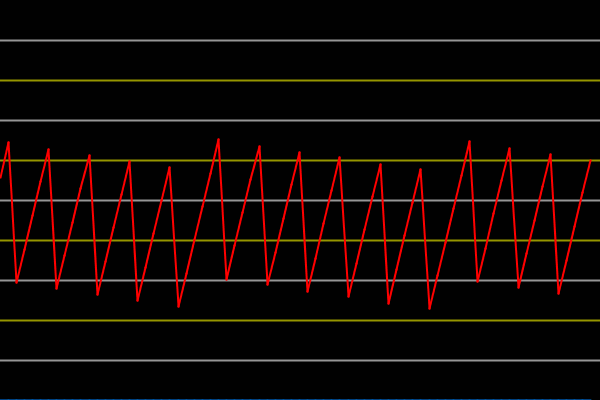

This project is a working example how to get an I2S DAC working on a Arduino.
This sketch uses port manipulation instead of the arduino's library function digitalRead and digitalWrite, because port
manipulation is faster and much more low end and can be easily ported to other microcontroller's as well.

This project uses a TM8211 as DAC which is a cheap chinese DAC IC, but you can use whatever you want.

Here you can see plott which is make with a simple Arduino oscilloscope

